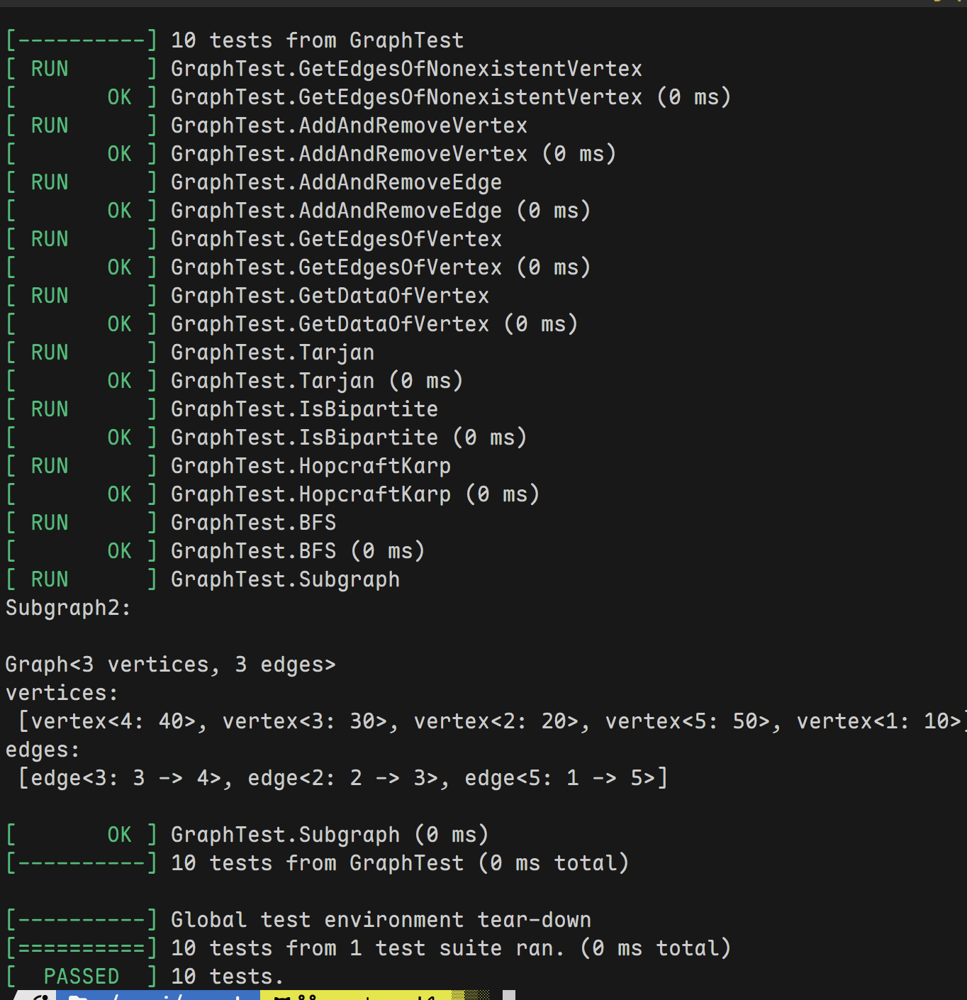

## libGraph
### build & test
使用[Xmake](Xmake.io)构建, 在MacOS, Wsl2的clang(21和20)编译器上(标准库是libcxx, gtest用的也是libcxx版本, 可以自己改成libstdc++)成功构建, 依赖gtest单元测试, 版本是cpp23.
```bash
xmake build && xmake run
```
即可编译运行.
### Feature
编译期多态(Template), 对于算法和不同的Vertax的data
在编译期就可以确定, 完全没有必要virtual.

算法是函数实现, 因为返回值是不确定的, 各个算法完全
不一样, 强行抽象是无法得到任何统一性, 但是函数是
模板函数, 支持图的多态.

储存数据和实现分离, 而且对于不能修改的数据使用const,
而非全部private然后提供get方法. 对于能修改的属性应当
直接暴露, 因为现在没有约束数据实现的方法, 当然
这里Vertax是多态的, 完全可以自己实现get, 然后让
Graph类作为friend class.

高度的扩展性, 无侵入, 正确性可以查看test.
类职责与主要方法

1. VertexBase
职责: 表示图中的基本顶点，包含唯一标识符 id。
主要方法:
toString(): 返回顶点的字符串表示。
operator==: 比较两个顶点是否相等。
2. Vertex<DataTy>
职责: 表示带有数据的顶点，继承自 VertexBase。
主要方法:
构造函数: 支持初始化顶点数据。
toString(): 返回带数据的顶点字符串表示。
3. Edge
职责: 表示图中的边，包含边的唯一标识符、起点、终点和权重。
主要方法:
toString(): 返回边的字符串表示。
operator==: 比较两个边是否相等。
4. GraphData<V>
职责: 存储图的核心数据，包括顶点和边的映射关系。
主要成员:
AdjMap: 邻接表，表示顶点到边的映射。
idToVertex: 顶点 ID 到顶点对象的映射。
idToEdge: 边 ID 到边对象的映射。
5. Graph<V>
职责: 表示通用的有向图。
主要方法:
addVertex, addEdge: 添加顶点和边。
delVertex, delEdge: 删除顶点和边。
numVertices, numEdges: 获取顶点和边的数量。
getDataOfVertex: 获取顶点的数据。
subgraphOfVertices, subgraphOfEdges: 获取顶点或边的子图。
面向对象要点:
抽象: 提供了通用的图操作接口。
多态: 允许子类（如 UndirectedGraph）重写方法。
6. UndirectedGraph<V>
职责: 表示无向图，继承自 Graph<V>。
主要方法:
重写 addEdge, delEdge: 处理无向图的边（添加反向边）。
complement: 生成补图。
面向对象要点:
继承: 继承自 Graph<V>。
多态: 重写了父类的边操作方法。
7. UndirectedEdgeIdCounter
职责: 生成无向图中边的唯一 ID，并提供配对 ID 的功能。
主要方法:
getNextId: 获取下一个边 ID。
getPairedId: 获取配对边的 ID。
8. GraphLib::algorithm
职责: 提供图算法的实现。
主要方法:
tarjan: 寻找图的割点。
distanceWithoutWeight: 计算两个顶点之间的最短路径（无权图）。
isBipartite: 判断图是否为二分图。
getMaxMatchByHopcraftKarp: 使用 Hopcroft-Karp 算法求最大匹配。

示例见test
运行
